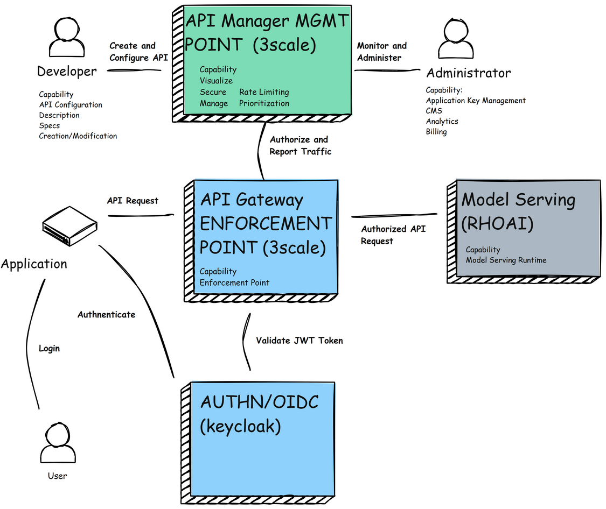

= Model as a Service (MaaS)

High Level Architecture of MaaS to move to capability focus instead of product focus

== Workflow

[source,text]
----
[User/Client App]
     |
     | (1) Auth → Keycloak (OAuth2)
     ↓
[Access Token]
     |
     | (2) API Call + Token → 3scale Gateway
     ↓
[3scale OIDC Plugin] --- verifies token with ---> Keycloak
     |
     | (3) Forward Authenticated Request
     ↓
[OpenShift AI Model Endpoint (Route)]
----

== 3scale and RHCL Current Capabilities (Noel)

== Checklist of Capabilities (Kenny)

== Pattern Assumptions (kenny)

== Existing Slides +
. https://docs.google.com/presentation/d/1R38W2ZuRo7zsX58airHsbstOO7UCVc5iRbAV7T1DYgA/edit?usp=sharing[^]

== Existing lab resources

. RH AI BU MaaS repo +
https://github.com/rh-aiservices-bu/models-aas[^]

. MaaS Workshop +
https://catalog.demo.redhat.com/catalog?item=babylon-catalog-event/summit-2025.lb1816-llmaas.event&utm_source=webapp&utm_medium=share-link[^]

. Roadshow with MaaS +
https://github.com/odh-labs/rhoai-roadshow-v2[^]

. MaaS automation +
https://github.com/redhat-gpte-devopsautomation/lb1816-summit-llm-aas[^]

== Potential Topics to Cover in the Lab

[#api_gateway]
=== API Gateway

* APISix
* 3scale
* LiteLLM

[#auth]
=== Authorization

* Keycloak
* Customer provided

== Keycloak and 3Scale

Use Keycloak to authenticate users and then obtain a token to use with Red Hat 3scale API Management. This is a common architecture where Keycloak handles identity and access management (IAM), while 3scale handles API rate limiting, analytics, and monetization.

Here are the high-level steps to configure Keycloak, 3scale, and OpenShift AI to authenticate and call a model through 3scale, ensuring secure, managed access to your AI model endpoints:

✅ Architecture Overview
Keycloak – Identity provider (IdP) for OAuth2/OIDC authentication.

3scale API Management – Secures and manages the API (model endpoint).

OpenShift AI (RHODS) – Hosts your deployed AI model (via ModelMesh or custom service).

User/Client – Requests a token from Keycloak, then calls the model via 3scale using that token.

🔧 Step-by-Step Configuration
🧩 1. Set up Keycloak as an Identity Provider
Deploy Keycloak (if not already available):

Use OpenShift Operator Hub or an external instance.

Create a Realm:

Name it (e.g., ai-realm).

Create a Client (for your API consumer app):

Client ID: ai-client

Access Type: confidential

Valid Redirect URIs: * (for testing) or your app URL

Enable Standard Flow and Client Credentials

Save the Client Secret

Create Users/Roles (optional):

Add users and assign roles or groups to manage access policies.

🔐 2. Secure AI Model with OpenShift Route & Token Auth
Deploy the Model via RHODS:

Either use Jupyter + ModelMesh (recommended) or a custom Flask/FastAPI service.

Expose via Route:

Create a Route in OpenShift to expose the model endpoint.

Ensure it’s protected by an OAuth2 token (Keycloak) or make it internal.

Test endpoint locally with curl or Postman using a Bearer token.

🛡️ 3. Configure 3scale to Manage the AI Model API
Set up 3scale Admin Portal:

Login to 3scale and create a new API Product (e.g., ai-model-api).

Create Backend for Model Endpoint:

Define the backend pointing to the OpenShift model URL (e.g., https://model-service.myproject.apps.cluster/model/predict).

Create the Product:

Link the backend.

Set up application plans and methods (e.g., /predict).

Set up OpenID Connect Auth (OIDC):

Go to [Integration > Settings] of the product.

Enable OpenID Connect.

Use Keycloak Realm Info:

Issuer: https://<keycloak-host>/realms/ai-realm

JSON Web Key Set (JWKS) URL: https://<keycloak-host>/realms/ai-realm/protocol/openid-connect/certs

Define Mapping Rules:

Match API paths (e.g., /predict) to usage metrics.

Update API Gateway Configuration:

Promote the staging config to production.

🧪 4. Test the Workflow
Get an access token from Keycloak:

bash
Copy
Edit
curl -X POST 'https://<keycloak-host>/realms/ai-realm/protocol/openid-connect/token' \
  -d 'grant_type=client_credentials' \
  -d 'client_id=ai-client' \
  -d 'client_secret=<your-secret>' \
  | jq
Call the model via 3scale gateway:

bash
Copy
Edit
curl -X POST 'https://<3scale-api-gateway-url>/predict' \
  -H "Authorization: Bearer <access_token>" \
  -H "Content-Type: application/json" \
  -d '{"input": [your_input_data]}'
3scale validates the token via OIDC, applies rate limits, and proxies to the model.

🖼️ Visual Flow Diagram (simplified)
plaintext
Copy
Edit
[User/Client App]
     |
     | (1) Auth → Keycloak (OAuth2)
     ↓
[Access Token]
     |
     | (2) API Call + Token → 3scale Gateway
     ↓
[3scale OIDC Plugin] --- verifies token with ---> Keycloak
     |
     | (3) Forward Authenticated Request
     ↓
[OpenShift AI Model Endpoint (Route)]
🧠 Optional Enhancements
Use Red Hat SSO (Keycloak) as a managed offering if available.

Configure Keycloak client scopes for more granular claims.

Apply 3scale rate limits, alerts, and API analytics.

Enable logging/monitoring via OpenShift Logging/Grafana/Prometheus.
