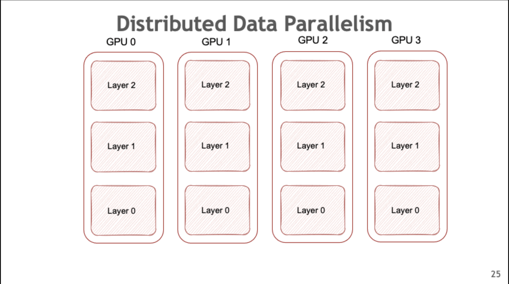

= Data Parallelism

== Data Parallelism Overview

Data Parallelism (DP) replicates the model across multiple GPUs. Data batches are evenly distributed between GPUs and the data-parallel GPUs process them independently. While the computation workload is efficiently distributed across GPUs, inter-GPU communication is required in order to keep the model replicas consistent between training steps.

.Distributed Data Parallelism

== Distributed Data Parallelism Fundamentals

Distributed Data Parallelism (DDP) keeps the model copies consistent by synchronizing parameter gradients across data-parallel GPUs before each parameter update. More specifically, it sums the gradients of all model copies using all-reduce communication collectives. 

